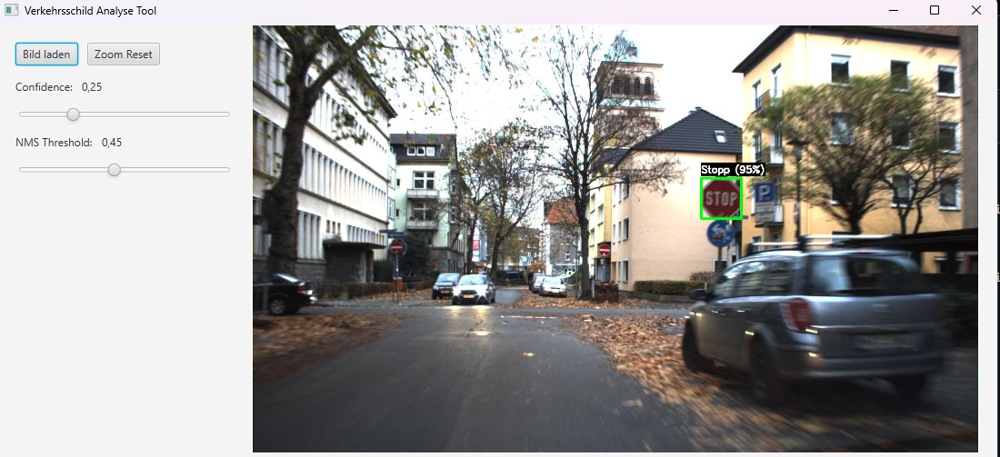
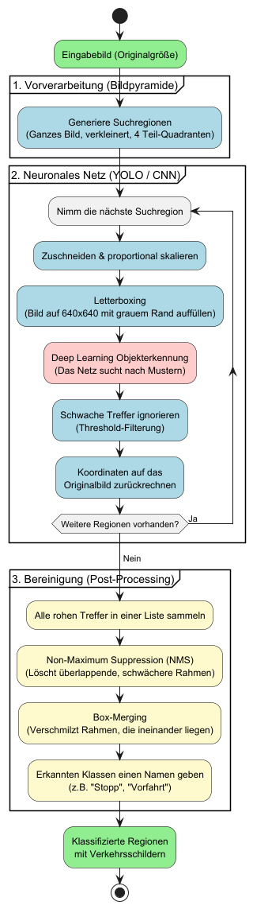

# Verkehrszeichenerkennung mit Java & YOLO

Dieses Projekt implementiert eine Verkehrszeichenerkennung in Java. Es nutzt ein selbst trainiertes YOLO-Modell (ONNX-Format, trainiert auf 3.000 Bildern), OpenCV und eine JavaFX-Benutzeroberfläche.

## 💡 Lösungskonzept

Herkömmliche Objekterkennungsmodelle haben oft Schwierigkeiten, extrem kleine Objekte in hochauflösenden Bildern zu finden. Um dieses Problem zu lösen, setzt dieses Projekt auf eine modulare Pipeline, die das Bild in einer **Bildpyramide** mehrfach analysiert.

Der Ablauf der Erkennung ist in drei Hauptschritte unterteilt:

### Architektur & Datenfluss

